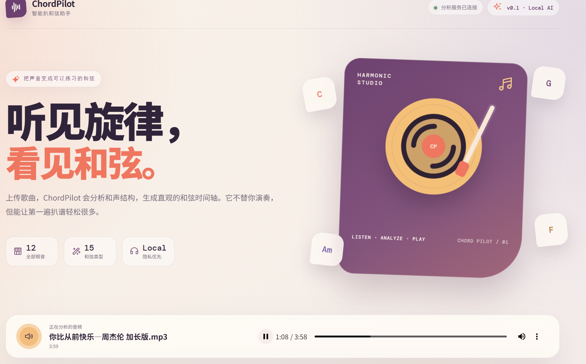
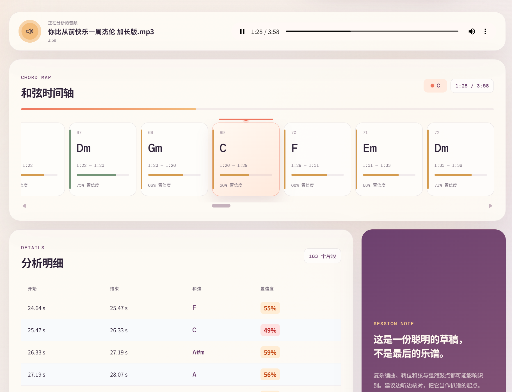
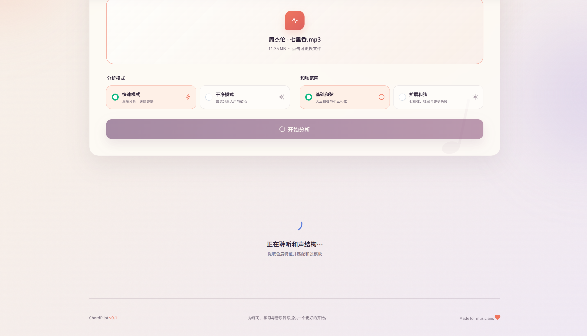
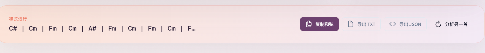

# ChordPilot

ChordPilot 是一个本地运行的音乐科技 Web 应用。上传 MP3 或 WAV 后，它会提取音频色度特征，通过手工和弦模板匹配生成和弦时间轴，帮助学习、练习和音乐转写。

> v0.1 的目标是生成“有用的和弦草稿”，而不是替代人工听辨或专业乐谱。

## 界面预览

### 音乐工作室首页与播放器



### 播放同步和弦时间轴



### 上传分析与加载状态



### 和弦进行复制与导出



## 功能

- 上传 `.mp3` / `.wav` 音频（最大 50 MB）
- 快速模式：直接进行和声分析
- 干净模式：可选 Demucs 分离，失败时自动回退
- 基础和弦：12 个根音的大三和弦、小三和弦
- 扩展和弦：7、maj7、m7、dim、aug、sus2、sus4、6、m6、m7b5、dim7、add9、5
- HTML5 音频播放
- 随播放自动滚动、高亮和跳转的横向和弦时间轴
- PrimeVue 分析明细表格
- 复制和弦进行、导出 TXT、导出 JSON

## 技术栈

- 前端：Vue 3、Vite、PrimeVue、PrimeIcons、Clipboard API
- 后端：Python、FastAPI、Uvicorn、librosa、NumPy、SciPy
- 可选：FFmpeg、Demucs

## 项目结构

```text
ChordPilot/
├── frontend/
│   ├── src/components/
│   ├── src/App.vue
│   ├── src/main.js
│   └── package.json
├── backend/
│   ├── main.py
│   ├── audio_loader.py
│   ├── chord_detector.py
│   ├── source_separator.py
│   ├── schemas.py
│   └── requirements.txt
└── README.md
```

## 启动后端

建议使用 Python 3.9–3.12。

```powershell
cd backend
py -3.12 -m venv .venv
.\.venv\Scripts\Activate.ps1
python -m pip install -r requirements.txt
python -m uvicorn main:app --reload --port 8000
```

访问 `http://localhost:8000/api/health`，应返回：

```json
{"status":"ok"}
```

## 启动前端

另开一个终端：

```powershell
cd frontend
npm install
npm run dev
```

浏览器打开 `http://localhost:5173`。

Vite 已配置 `/api` 开发代理，前端请求会转发至 `http://localhost:8000`。后端也允许 5173 端口的本地跨域请求。

## Windows 一键启动

完成一次依赖安装后，可以直接在项目根目录运行：

```powershell
.\start.ps1
```

脚本会分别启动前端和后端，并自动打开 `http://localhost:5173`。页面右上角显示“分析服务已连接”后即可上传歌曲。

## 音频依赖说明

WAV 与常见 MP3 通常可由 `soundfile` 直接读取。项目还包含 `imageio-ffmpeg` 作为便携解码回退，因此快速模式无需单独安装系统 FFmpeg。

如需使用 Demucs，Windows 上建议安装带动态库的 shared FFmpeg：

```powershell
winget install --id Gyan.FFmpeg.Shared --exact
ffmpeg -version
```

命令能显示版本信息后，请重启终端与后端。

## Demucs 干净模式

Demucs **不是必需依赖**。没有安装 Demucs 时，快速模式仍可完整运行；选择干净模式会显示提示并自动回退到快速分析流程。

如需启用，可安装可选依赖：

```powershell
python -m pip install -r requirements-clean.txt
```

Demucs 需要 shared FFmpeg，首次运行也可能下载模型。分离过程比快速模式慢得多。当前实现执行四分轨并合成 `bass + other` 作为分析轨，在请求结束后清理临时文件。若依赖、模型或分离过程出现问题，接口会返回警告并自动使用快速模式。

## 运行测试

后端包含和弦模板、基础和弦进行和扩展和弦的回归测试：

```powershell
cd backend
.\.venv\Scripts\Activate.ps1
python -m unittest discover -s tests -v
```

## 算法说明

1. 音频转为单声道并重采样至 22050 Hz
2. 幅度归一化并提取谐波成分
3. 自动估计调音偏差，使用 CQT Chroma 获取 12 维音级能量
4. 通过运行均值白化和邻域滤波降低音色、旋律与噪声影响
5. 额外提取低频色度，利用贝斯声部强化根音判断
6. 优先按节拍同步聚合，节拍不可靠时回退至固定时间窗
7. 与手工构造并归一化的和弦模板计算相似度
8. 估计全曲调性，为调内和弦提供轻量上下文先验
9. 使用 HMM/Viterbi 解码平滑时间序列，减少和弦抖动
10. 低置信度扩展和弦回退至大/小三和弦，仍不足时标为 `Unknown`

算法设计参考了开源项目 Chordino / NNLS Chroma、Essentia 和经典自动和弦识别流程，但当前实现为适合本项目的轻量 Python 版本，没有复制其源码或引入强制运行时依赖。

相关开源资料：

- [Chordino / NNLS Chroma](https://github.com/c4dm/nnls-chroma)
- [Essentia](https://github.com/MTG/essentia)
- [librosa](https://github.com/librosa/librosa)

前端视觉图标使用开源 [Phosphor Icons](https://github.com/phosphor-icons/core)，唱片海报、纹理与装饰图形由项目内 SVG/CSS 生成，无需外部图片服务。

## 当前限制

- 复杂编曲、强打击乐、转位和弦、调音偏差会降低准确度
- 固定时间窗尚未对齐节拍或小节
- Chroma 模板不能可靠区分所有高阶和弦语境
- 没有登录、数据库或云端存储
- v0.1 不显示钢琴五线谱或吉他六线谱

## Roadmap

- v0.1 上传音频，识别和弦时间轴
- v0.2 加入节拍检测和小节划分
- v0.3 接入 Basic Pitch，实现音频转 MIDI
- v0.4 显示钢琴卷帘图
- v0.5 生成简易钢琴五线谱
- v0.6 生成简易吉他六线谱
- v1.0 支持手动修正、导出 MIDI / MusicXML / TXT
